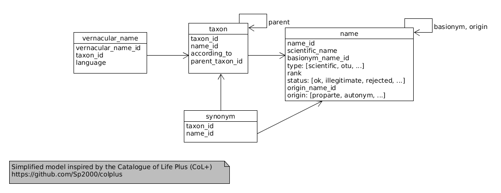

Taxonomy Concepts

Based on work done by the [Catalogue of Life Plus (CoL+)]( https://github.com/Sp2000/colplus) project.

## How to store
This section is "work-in-progress"
 * Homotypic synonyms ([definition](https://github.com/DINA-Web/dina-use-cases/blob/master/glossary.md#homotypic-synonym))
   * The originally published name is stored in the `name` table
   * All homotypic synonyms point to the originally published name using `origin_name_id`
   * The status of each homotypic synonyms is set accordingly (e.g. Orthographic variant)
   
 * Heterotypic synonyms ([definition](https://github.com/DINA-Web/dina-use-cases/blob/master/glossary.md#heterotypic-synonym))
   * The taxon points to the "accepted" name
   * All heterotypic synonyms are recorded in the `synonym` table
   * New combination
     * `origin` is set "basionym" ?
   * New split
     * `origin` is set "pro parte" ?
  
